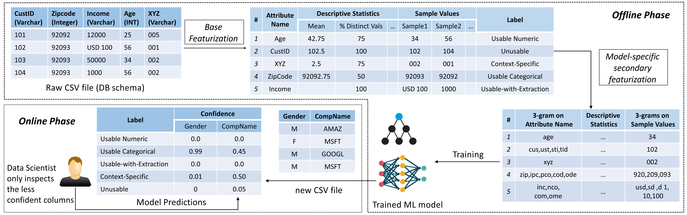

# Task: ML Schema Inference

This [project](https://adalabucsd.github.io/sortinghat.html) is about inferring ML feature types from the raw CSV files. 

Data/ contains the base featurized file. The raw 360 data files is available here for [download](https://drive.google.com/file/d/1HGmDRBSZg-Olym2envycHPkb3uwVWHJX/view?usp=sharing). 
Models/ contain the source code of the models such as Random Forest, RBF-SVM, k-NN, Neural Model and Logistic Regression.
Pre-trained Models/ contain the trained ML models ready for inference.

We invite researchers and practitioners to use our datasets and contribute to create better featurizations and models.

## Leaderboard

By submitting results, you acknowledge that your holdout test results([X_test.csv,y_test.csv]) are obtained purely by training on the training set([X_train.csv,y_train.csv]).

|        Model        | Overall Accuracy | Usable Numeric Accuracy | Usable-with-Extraction  Accuracy | Usable-Categorical Accuracy | Unusable Accuracy | Context-Specific Accuracy |
|:-------------------:|:----------------:|:-----------------------:|:--------------------------------:|:---------------------------:|:-----------------:|:-------------------------:|
| Random Forest       | 89.4             | 95.8                    | 79.7                             | 93.5                        | 74.3              | 83.4                      |
| k-NN                | 88.8             | 95.6                    | 77.6                             | 87.9                        | 79                | 85.6                      |
| Character-level CNN | 88.3             | 93.6                    | 83.9                             | 88.2                        | 83.2              | 83.2                      |
| RBF-SVM             | 87.4             | 94                      | 84.6                             | 89.1                        | 76                | 80.7                      |
| Logistic Regression | 86               | 94.5                    | 73.4                             | 86.8                        | 78.4              | 77.2                      |
